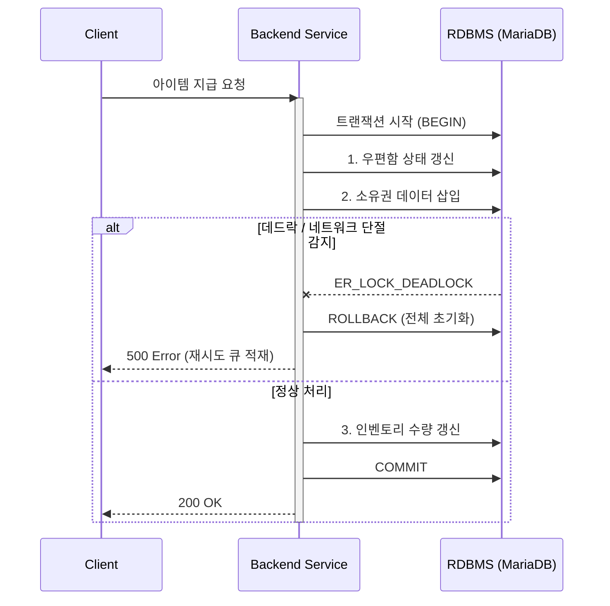

  
  <h1>Taeyeon Kim</h1>
  <strong>Backend Engineer & System Architect</strong>
    
  단순한 기능 구현을 넘어, 대용량 트래픽 환경에서의 데이터 무결성 보장과 지연 시간 최소화에 집중합니다.  운영 환경의 실패를 상정하고 이를 방어하는 아키텍처 설계에 강점이 있습니다.
    

  
  

 

## Engineering Stack

  
  
  
   
  
  
  
   
  
  

---

## Architecture Insights

### 1. Atomic Transaction Flow (데이터 무결성 보장)
다중 테이블 갱신 시 네트워크 단절 및 데드락을 방어하는 원자적 트랜잭션 파이프라인. (메타버스 재화 시스템 적용)

### 2. Core Implementation Matrix

| Domain | Challenge | Implementation & Result |
| :--- | :--- | :--- |
| **Low Latency** | 순차적 AI 오디오 처리(REST API) 시 응답 지연 발생 | WebSocket + Smart VAD 기반 **실시간 양방향 스트리밍** 마이그레이션. 지연 시간 85% 단축 |
| **High Concurrency** | 당일 활성 유저 실시간 랭킹 산정 시 RDBMS I/O 병목 | **Redis Sorted Set (ZADD)** 인메모리 아키텍처 도입. 조회 병목 해소 및 처리 속도 최적화 |
| **Fault Tolerance** | 특정 로직 결함으로 인한 메모리 누수 발생 시 서버 다운 | **PM2 클러스터 기반 Auto-Healing** 파이프라인 적용. 자동 재시작을 통한 무중단 복구 |
| **Probability Engine** | 확률형 가챠 시스템에서 클라이언트 조작 방지 필요 | 서버 사이드 유저 상태 검증 및 **안전한 난수 생성(RNG)** 기반 확률 분기 트랜잭션 처리 |
| **Closed Network** | 외부 망이 차단된 환경에서 이기종 장비 간 연동 | 폐쇄망 내부 **TCP/IP 소켓 통신 규격 설계** 및 C# 앱 - Node.js 간 텔레메트리 데이터 매핑 |

---

## DevSecOps & Troubleshooting Log

* **DB Connection Pool Leak:** 특정 로직 내 트랜잭션 미해제로 인한 활성 커넥션 누수 식별. QueryRunner 반환 강제화 및 커넥션 타임아웃 튜닝.
* **Concurrent Update Collision:** 동시 다발적 보상 API 호출로 인한 동일 Row 데드락 발생. 비즈니스 로직 쿼리 순서 정렬 및 Lock 스코프 최소화 적용.
* **Pipeline Breakdown:** Ubuntu 서버 환경에서 Jenkins 배포 중 SSH 인증 실패 디버깅. 무중단 서비스 유지를 위한 PM2 배포 스크립트 멱등성 보장 코드 작성.

---

## Contact
* **Email:** ktyeon92@gmail.com
* **Interactive Portfolio:** https://hugekite.github.io/myInfo.github.io/
